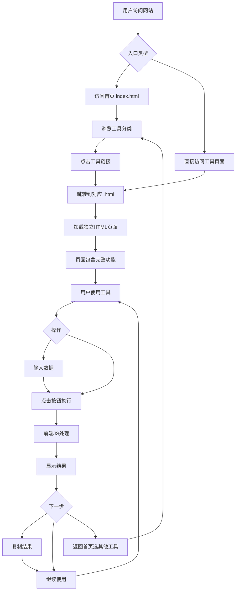

# 产品需求文档 (PRD) - 在线工具集网站

## 1. 产品概述
基于 tools-web 项目构建的纯静态 HTML 在线工具集合网站，提供开发运维、文本处理、图像处理等多类别实用工具，每个工具为独立 HTML 页面。
- 整合 60+ 在线工具，涵盖开发、文本、图像、计算等多个领域
- 采用纯 HTML/CSS/JS 实现，无需构建工具，可直接部署
- 目标：打造轻量级、易部署的一站式在线工具平台

## 2. 核心功能

### 2.1 用户角色
| 角色 | 访问方式 | 核心权限 |
|------|----------|----------|
| 访客 | 直接访问 URL | 浏览和使用所有工具功能 |

### 2.2 功能模块
1. **首页 (index.html)**: 工具分类展示、热门工具推荐、搜索功能
2. **工具页面**: 每个工具一个独立 HTML 文件，包含完整功能
3. **公共组件**: 导航栏、页脚、样式文件（通过 JS 动态加载或复制粘贴）

### 2.3 技术特点
- **纯静态**: 无需 Node.js、Webpack 等构建工具
- **独立页面**: 每个 HTML 文件可独立运行
- **轻量快速**: 加载速度快，适合 CDN 部署
- **易于维护**: 清晰的文件结构，便于单独更新某个工具

### 2.4 工具列表（核心工具）

**开发运维类**:
- 随机密码生成器 (randompassword.html)
- URL编码/解码 (urlencode.html)
- UUID生成器 (uuid.html)
- 时间戳转换 (timetran.html)
- MD5加密 (md5.html)
- JSON格式化 (json.html)
- 正则测试 (reg.html)
- Unicode转换 (unicode.html)
- HTTP状态码查询 (httpstatuscode.html)
- JWT解析 (jwt.html)
- HTML实体转义 (htmlentity.html)
- JS格式化/压缩 (jsformat.html)
- HTML格式化 (htmlformat.html)
- CSS格式化/压缩 (cssformat.html)
- Base64加解密 (base64.html)
- 进制转换 (scaletran.html)
- Hash计算 (hashcalculator.html)
- SQL格式化 (sqlformat.html)
- XML格式化 (xmlformat.html)

**文本处理类**:
- 文本统计 (wordcount.html)
- 词频统计 (wordfrequency.html)
- 文本去重 (textremoveduplicate.html)
- 文本替换 (textreplace.html)
- Markdown编辑器 (markdown.html)
- ASCII艺术字 (asciiwordpic.html)
- 中英文数字转换 (numbertochinese.html)
- 莫斯电码转换 (morse.html)

**图像处理类**:
- 图片裁剪 (imgcut.html)
- 图片水印 (imagewatermark.html)
- 颜色选择器 (colorpicker.html)
- 图片取色器 (imagecolorpicker.html)
- 二维码生成 (qrcode.html)

**单位转换类**:
- 长度单位转换 (length.html)
- 面积单位转换 (area.html)
- 重量单位转换 (weight.html)
- 温度单位转换 (temperature.html)
- 时间单位转换 (time_unit.html)
- 压力单位转换 (pressure.html)
- 功率单位转换 (power.html)
- 存储单位转换 (storageconverter.html)
- 热量单位转换 (heat.html)

**图表工具**:
- 柱状图 (bar.html)
- 折线图 (line.html)
- 饼图 (pie.html)
- 散点图 (scatter.html)
- 词云图 (wordcloud.html)

**娱乐工具**:
- 抛硬币 (coin.html)
- 掷骰子 (dice.html)
- 随机选择 (random.html)
- 抽奖转盘 (lottery.html)
- 石头剪刀布 (rockpaperscissors.html)
- 反应力测试 (reactiontest.html)
- 番茄钟 (pomodoro.html)
- 弹幕生成 (barrage.html)
- 转盘 (wheel.html)
- Emoji表情 (emoji.html)
- 文本对比 (diff.html)
- 计算器 (calculator.html)
- 色板生成 (colorpalette.html)
- IP查询 (ip.html)
- 网站信息查询 (webinfo.html)

## 3. 核心流程



## 4. 用户界面设计

### 4.1 设计风格
- **主色调**: 科技蓝 (#409EFF) + 渐变紫 (#667eea, #764ba2)
- **辅助色**: 浅灰背景 (#f0f2f5)，白色卡片 (#ffffff)
- **按钮风格**: 圆角 (border-radius: 8px)，渐变色或纯色，hover 有过渡效果
- **字体**: 
  - 中文：系统默认 (-apple-system, BlinkMacSystemFont, "Segoe UI", "Microsoft YaHei")
  - 代码：'Consolas', 'Monaco', 'Courier New', monospace
- **布局**: 
  - 首页：顶部导航 + 工具卡片网格 + 底部
  - 工具页：顶部导航 + 工具标题 + 输入输出区 + 操作按钮 + 底部
- **图标**: 使用 Emoji 或简单的 SVG/PNG 图标
- **特色设计**:
  - 科技感渐变背景
  - 卡片阴影和 hover 效果
  - 平滑的 CSS 过渡动画
  - 自定义滚动条样式

### 4.2 页面结构模板

**首页 (index.html)**:
```
┌─────────────────────────────────────┐
│         导航栏 (Logo + 菜单)        │
├─────────────────────────────────────┤
│          Hero 区域 (标题+副标题)     │
├─────────────────────────────────────┤
│  ┌─────┐ ┌─────┐ ┌─────┐ ┌─────┐  │
│  │开发  │ │文本  │ │图像  │ │单位  │  │
│  │运维  │ │处理  │ │处理  │ │转换  │  │
│  └─────┘ └─────┘ └─────┘ └─────┘  │
├─────────────────────────────────────┤
│       热门工具推荐 (横向滚动)        │
├─────────────────────────────────────┤
│  ┌──────┐ ┌──────┐ ┌──────┐       │
│  │工具1  │ │工具2  │ │工具3  │ ...  │
│  └──────┘ └──────┘ └──────┘       │
├─────────────────────────────────────┤
│            底部信息栏                │
└─────────────────────────────────────┘
```

**工具页面 (tool-name.html)**:
```
┌─────────────────────────────────────┐
│  导航栏 (Logo + 返回首页 + 工具名称)  │
├─────────────────────────────────────┤
│           工具标题区域               │
│      (图标 + 标题 + 功能描述)        │
├─────────────────────────────────────┤
│  ┌─────────────────────────────┐   │
│  │                             │   │
│  │        输入/操作区域         │   │
│  │   (表单/编辑器/上传等)       │   │
│  │                             │   │
│  └─────────────────────────────┘   │
│                                     │
│        [执行按钮] [重置按钮]         │
│                                     │
│  ┌─────────────────────────────┐   │
│  │                             │   │
│  │        输出/结果区域         │   │
│  │   (结果展示/预览/下载)       │   │
│  │                             │   │
│  └─────────────────────────────┘   │
├─────────────────────────────────────┤
│            底部信息栏                │
└─────────────────────────────────────┘
```

### 4.3 响应式设计
- **移动优先** 或 **桌面优先** 均可
- 使用 CSS Media Queries 实现响应式
- 断点设置:
  - 手机: < 640px
  - 平板: 640px - 1024px
  - 桌面: > 1024px
- 移动端优化:
  - 导航菜单改为汉堡菜单
  - 工具卡片网格自适应（1-2-3列）
  - 触摸友好的按钮尺寸
  - 表单元素适配触摸操作

### 4.4 技术约束与依赖
- **CDN 依赖** (通过 `<script>` / `<link>` 引入):
  - 可选：Tailwind CSS (CDN 版本)
  - 可选：Element Plus (CDN 版本) 或其他 UI 库
  - 可选：ECharts (图表工具)
  - 可选：highlight.js (代码高亮)
  - 必要时使用：crypto-js (加密)、qrcodejs (二维码) 等
- **不依赖**:
  - 不需要 npm/Node.js
  - 不需要 Webpack/Vite 构建
  - 不需要框架 (Vue/React)
  - 可以使用原生 JavaScript ES6+

## 5. 文件组织策略

### 5.1 方案一：完全独立（推荐）
每个 HTML 文件完全自包含：
- 包含完整的 `<html>`, `<head>`, `<body>`
- 内联 CSS (`<style>`) 或引用公共 CSS
- 内联 JS (`<script>`) 或引用公共 JS
- 优点：可独立部署，无依赖问题
- 缺点：有代码重复

### 5.2 方案二：共享资源
公共部分提取到独立文件：
- `css/common.css` - 公共样式
- `css/tool.css` - 工具页面样式
- `js/common.js` - 公共函数（导航栏、页脚等）
- `js/tools/` - 各工具的逻辑 JS
- 优点：减少重复，易于维护
- 缺点：需要确保路径正确

### 5.3 推荐混合方案
- 首页和导航/页脚使用共享资源
- 工具页面保持相对独立，但共享基础 CSS 和组件 JS
