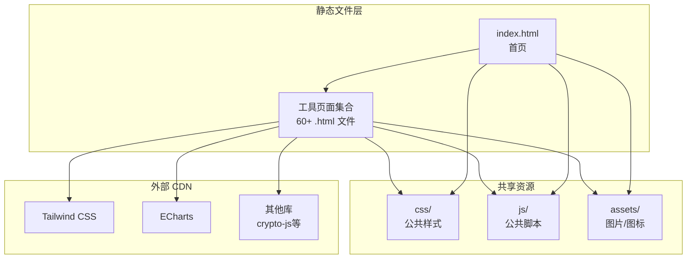
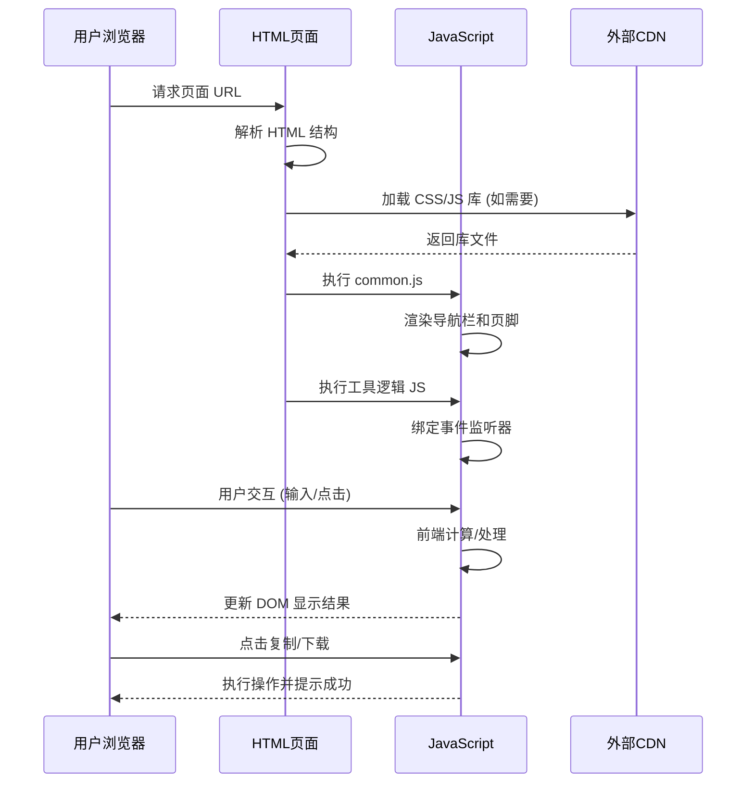

# 技术架构文档 - 在线工具集网站（纯 HTML 版本）

## 1. 架构设计



## 2. 技术选型

### 核心技术栈
| 技术 | 版本 | 用途 | 引入方式 |
|------|------|------|----------|
| HTML5 | - | 页面结构 | 原生 |
| CSS3 | - | 样式和布局 | `<style>` 或 `.css` 文件 |
| JavaScript ES6+ | - | 交互逻辑 | `<script>` 或 `.js` 文件 |
| Tailwind CSS | 3.x (CDN) | 快速样式开发 | CDN link |
| ECharts | 5.x (CDN) | 图表渲染 | CDN script |
| Highlight.js | 11.x (CDN) | 代码高亮 | CDN script |
| Crypto-JS | 4.x (CDN) | 加密解密 | CDN script |
| QRCode.js | - | 二维码生成 | CDN script 或内联 |

### 可选库（按需引入）
- **Prism.js**: 轻量级代码高亮替代
- **Prettier**: 代码格式化 (standalone 版本)
- **SQL Formatter**: SQL 格式化
- **CSSO**: CSS 压缩
- **html2canvas**: 截图功能
- **Figlet**: ASCII 艺术字
- **Morse code library**: 莫斯电码

### 开发工具
- **编辑器**: VS Code / WebStorm
- **浏览器**: Chrome / Firefox / Edge (现代浏览器支持)
- **版本控制**: Git
- **部署方式**: 直接复制文件到服务器 / GitHub Pages / Vercel / Netlify

## 3. 目录结构

```
public/
├── index.html                 # 首页
├── robots.txt                 # SEO 爬虫规则
├── sitemap.xml                # 站点地图
│
├── css/                       # 样式文件
│   ├── common.css             # 公共样式（重置、变量、导航、页脚）
│   ├── home.css               # 首页专用样式
│   └── tool.css               # 工具页面通用样式
│
├── js/                        # JavaScript 文件
│   ├── common.js              # 公共脚本（导航、页脚、工具函数）
│   ├── tools/                 # 各工具的逻辑脚本
│   │   ├── randompassword.js  # 随机密码生成
│   │   ├── urlencode.js       # URL 编码解码
│   │   ├── uuid.js            # UUID 生成
│   │   ├── timetran.js        # 时间戳转换
│   │   ├── md5.js             # MD5 加密
│   │   ├── json.js            # JSON 格式化
│   │   ├── reg.js             # 正则测试
│   │   └── ...                # 其他工具脚本
│   └── lib/                   # 第三方库（本地备份）
│       ├── qrcode.min.js      # 二维码库
│       └── ...                # 其他库
│
├── assets/                    # 静态资源
│   ├── images/
│   │   ├── logo.png           # 网站 Logo
│   │   └── logo/              # 工具图标目录
│   │       ├── keywords.png
│   │       ├── url.png
│   │       └── ...            # 所有工具图标
│   ├── dice/                  # 骰子图片
│   └── coin/                  # 硬币图片
│
├── tools/                     # 工具页面目录（可选，也可放在根目录）
│   ├── randompassword.html    # 随机密码生成
│   ├── urlencode.html         # URL 编码解码
│   ├── uuid.html              # UUID 生成
│   ├── timetran.html          # 时间戳转换
│   ├── md5.html               # MD5 加密
│   ├── json.html              # JSON 格式化
│   ├── reg.html               # 正则测试
│   ├── unicode.html           # Unicode 转换
│   ├── httpstatuscode.html    # HTTP 状态码
│   ├── jwt.html               # JWT 解析
│   ├── htmlentity.html        # HTML 实体转义
│   ├── jsformat.html          # JS 格式化
│   ├── htmlformat.html        # HTML 格式化
│   ├── cssformat.html         # CSS 格式化
│   ├── base64.html            # Base64 加解密
│   ├── scaletran.html         # 进制转换
│   ├── hashcalculator.html    # Hash 计算
│   ├── sqlformat.html         # SQL 格式化
│   ├── xmlformat.html         # XML 格式化
│   ├── wordcount.html         # 文本统计
│   ├── wordfrequency.html     # 词频统计
│   ├── textremoveduplicate.html  # 文本去重
│   ├── textreplace.html       # 文本替换
│   ├── markdown.html          # Markdown 编辑器
│   ├── asciiwordpic.html      # ASCII 艺术字
│   ├── numbertochinese.html   # 数字转中文
│   ├── morse.html             # 莫斯电码
│   ├── imgcut.html            # 图片裁剪
│   ├── imagewatermark.html    # 图片水印
│   ├── colorpicker.html       # 颜色选择器
│   ├── imagecolorpicker.html  # 图片取色器
│   ├── qrcode.html            # 二维码生成
│   ├── length.html            # 长度转换
│   ├── area.html              # 面积转换
│   ├── weight.html            # 重量转换
│   ├── temperature.html       # 温度转换
│   ├── time.html              # 时间转换
│   ├── pressure.html          # 压力转换
│   ├── power.html             # 功率转换
│   ├── storageconverter.html  # 存储转换
│   ├── heat.html              # 热量转换
│   ├── bar.html               # 柱状图
│   ├── line.html              # 折线图
│   ├── pie.html               # 饼图
│   ├── scatter.html           # 散点图
│   ├── wordcloud.html         # 词云图
│   ├── coin.html              # 抛硬币
│   ├── dice.html              # 掷骰子
│   ├── random.html            # 随机选择
│   ├── lottery.html           # 抽奖转盘
│   ├── rockpaperscissors.html # 石头剪刀布
│   ├── reactiontest.html      # 反应力测试
│   ├── pomodoro.html          # 番茄钟
│   ├── barrage.html           # 弹幕生成
│   ├── wheel.html             # 转盘
│   ├── emoji.html             # Emoji 表情
│   ├── diff.html              # 文本对比
│   ├── calculator.html        # 计算器
│   ├── colorpalette.html      # 色板生成
│   ├── ip.html                # IP 查询
│   └── webinfo.html           # 网站信息查询
│
└── README.md                  # 项目说明（可选）
```

## 4. 页面模板规范

### 4.1 标准 HTML 结构

```html
<!DOCTYPE html>
<html lang="zh-CN">
<head>
    <meta charset="UTF-8">
    <meta name="viewport" content="width=device-width, initial-scale=1.0">
    <meta name="description" content="工具描述">
    <meta name="keywords" content="关键词">
    <title>工具名称 - 在线工具集</title>
    
    <!-- 引入 Tailwind CSS (CDN) -->
    <script src="https://cdn.tailwindcss.com"></script>
    
    <!-- 引入公共样式 -->
    <link rel="stylesheet" href="../css/common.css">
    <link rel="stylesheet" href="../css/tool.css">
    
    <!-- 引入特定库（按需） -->
    <script src="https://cdn.jsdelivr.net/npm/crypto-js@4.2.0/crypto-js.js"></script>
</head>
<body>
    <!-- 导航栏 -->
    <nav id="navbar"></nav>
    
    <!-- 主内容区 -->
    <main class="container mx-auto px-4 py-8">
        <!-- 工具标题 -->
        <header class="tool-header mb-8">
            <h1>工具名称</h1>
            <p>工具描述说明</p>
        </header>
        
        <!-- 工具内容区 -->
        <div class="tool-content">
            <!-- 输入区 -->
            <div class="input-section">...</div>
            
            <!-- 操作按钮 -->
            <div class="action-buttons">...</div>
            
            <!-- 输出区 -->
            <div class="output-section">...</div>
        </div>
    </main>
    
    <!-- 页脚 -->
    <footer id="footer"></footer>
    
    <!-- 引入公共脚本 -->
    <script src="../js/common.js"></script>
    
    <!-- 引入工具逻辑 -->
    <script src="../js/tools/工具名.js"></script>
</body>
</html>
```

### 4.2 首页特殊结构

```html
<!-- index.html 特有部分 -->
<main>
    <!-- Hero 区域 -->
    <section class="hero">...</section>
    
    <!-- 工具分类 -->
    <section class="categories">
        <!-- 分类卡片网格 -->
        <div class="grid grid-cols-1 md:grid-cols-2 lg:grid-cols-4 gap-6">
            <a href="tools/randompassword.html" class="category-card">
                
                <h3>随机密码生成</h3>
                <p>描述文字</p>
            </a>
            <!-- 更多工具卡片... -->
        </div>
    </section>
    
    <!-- 热门工具 -->
    <section class="popular-tools">...</section>
</main>
```

## 5. 共享模块设计

### 5.1 common.css 内容
```css
/* CSS 变量定义 */
:root {
  --primary-color: #409EFF;
  --secondary-color: #667eea;
  --bg-color: #f0f2f5;
  --card-bg: #ffffff;
  --text-primary: #333333;
  --text-secondary: #666666;
  --border-radius: 8px;
  --shadow: 0 2px 12px rgba(0, 0, 0, 0.1);
}

/* 重置样式 */
* { margin: 0; padding: 0; box-sizing: border-box; }

/* 导航栏样式 */
.navbar { ... }

/* 页脚样式 */
.footer { ... }

/* 工具页面通用样式 */
.tool-header { ... }
.tool-content { ... }
.input-section { ... }
.output-section { ... }

/* 按钮、表单、卡片等通用组件 */
.btn { ... }
.card { ... }

/* 响应式断点 */
@media (max-width: 640px) { ... }
@media (min-width: 641px) and (max-width: 1024px) { ... }
@media (min-width: 1025px) { ... }

/* 科技感背景 */
body {
  background-color: var(--bg-color);
  background-image: radial-gradient(...);
}

/* 自定义滚动条 */
::-webkit-scrollbar { ... }
```

### 5.2 common.js 功能
```javascript
// 动态加载导航栏
function loadNavbar() { ... }

// 动态加载页脚
function loadFooter() { ... }

// 复制到剪贴板
function copyToClipboard(text) { ... }

// 显示提示消息
function showToast(message, type) { ... }

// 工具函数库
const Utils = {
  formatDate: function() { ... },
  debounce: function() { ... },
  throttle: function() { ... },
  // ...
};

// 初始化
document.addEventListener('DOMContentLoaded', function() {
  loadNavbar();
  loadFooter();
});
```

## 6. 路由与导航

### 6.1 URL 结构
```
/                           → 首页
/tools/randompassword.html   → 随机密码生成
/tools/urlencode.html        → URL编码解码
/tools/md5.html              → MD5加密
...
```

### 6.2 导航配置
在 `common.js` 中维护工具列表数据：

```javascript
const TOOLS_LIST = [
  {
    category: '开发运维',
    icon: '💻',
    tools: [
      { name: '随机密码生成', url: 'tools/randompassword.html', icon: '🔑', desc: '...' },
      { name: 'URL编码解码', url: 'tools/urlencode.html', icon: '🔗', desc: '...' },
      // ...
    ]
  },
  {
    category: '文本处理',
    icon: '📝',
    tools: [...]
  },
  // 更多分类...
];
```

## 7. 性能优化策略

### 7.1 资源加载优化
- **CSS/JS 压缩**: 生产环境使用压缩版本
- **图片优化**: 使用 WebP 格式，适当压缩
- **懒加载**: 非首屏资源延迟加载
- **CDN 加速**: 利用 CDN 分发静态资源
- **缓存策略**: 设置合理的 Cache-Control 头

### 7.2 代码优化
- **避免重复代码**: 提取公共函数到 common.js
- **事件委托**: 减少事件监听器数量
- **DOM 操作优化**: 批量操作，减少回流重绘
- **防抖节流**: 对频繁操作进行优化

### 7.3 SEO 优化
- **语义化 HTML**: 使用正确的标签
- **Meta 信息**: 每个页面都有 title、description、keywords
- **Sitemap.xml**: 包含所有页面 URL
- **Robots.txt**: 允许搜索引擎抓取
- **结构化数据**: 可选添加 Schema.org 标记

## 8. 部署方案

### 8.1 静态服务器部署
- **Nginx**: 配置静态文件服务、Gzip 压缩、缓存
- **Apache**: 配置 .htaccess 启用压缩
- **GitHub Pages**: 推送到 gh-pages 分支即可
- **Vercel/Netlify**: 连接 Git 仓库自动部署

### 8.2 Nginx 配置示例
```nginx
server {
    listen 80;
    server_name tools.example.com;
    root /var/www/public;
    index index.html;

    # Gzip 压缩
    gzip on;
    gzip_types text/css application/javascript image/svg+xml;

    # 缓存静态资源
    location ~* \.(css|js|png|jpg|jpeg|gif|ico|svg)$ {
        expires 30d;
        add_header Cache-Control "public, immutable";
    }

    # SPA 兼容（如果需要）
    location / {
        try_files $uri $uri/ =404;
    }
}
```

## 9. 数据流示意


